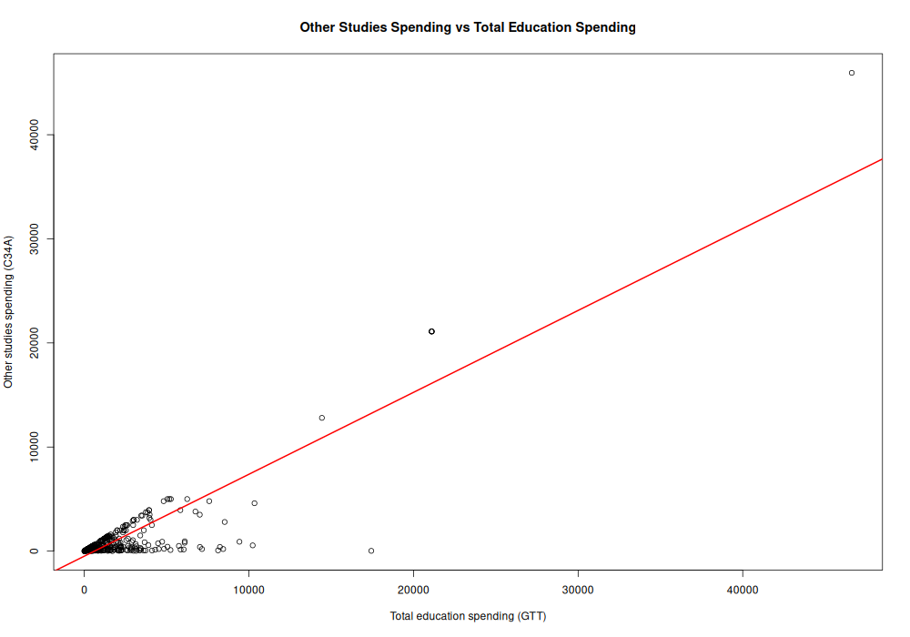
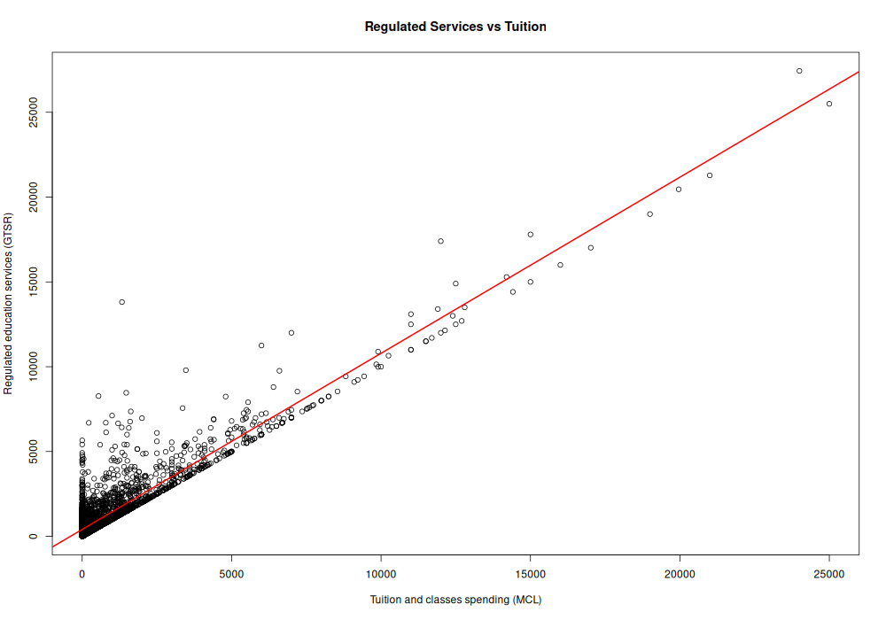
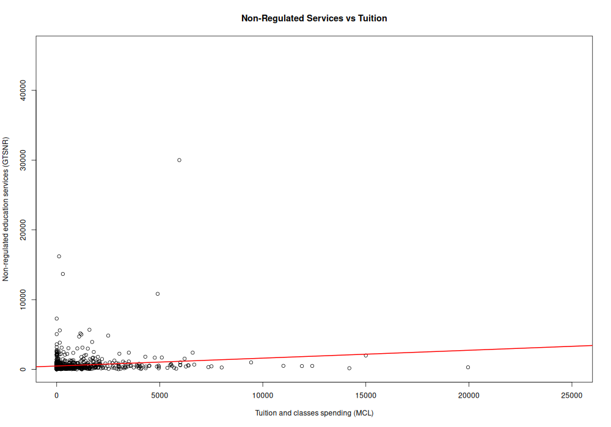
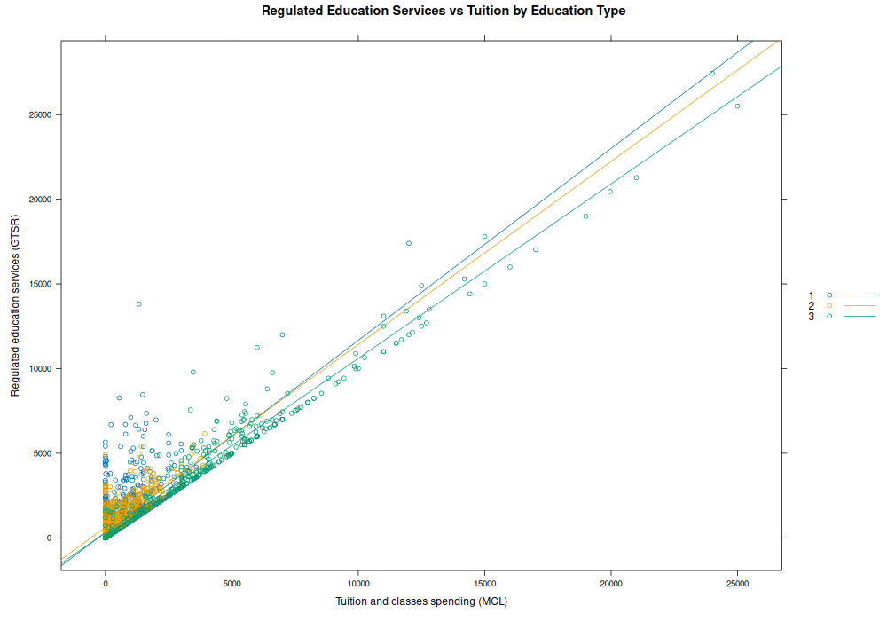

# Education Spending Regression Analysis

## Objective
Analyze the relationship between total education spending and specific education expenses using regression models.

## Project Overview
This project performs a regression analysis on household education spending data to identify relationships between total spending and different categories of educational expenses.

## Dataset
- Source: Household education expenditure dataset
- Variables used:
  - GTT: Total education spending
  - C34A: Spending on other studies
  - GTSR, GTSNR, MCL: Additional expenditure variables

## Methods
- Data cleaning and filtering
- Scatter plot visualization
- Linear regression models
- Correlation analysis (R²)
- Group comparison by education type

## Tools
- R (base functions)
- readr
- lattice

## Key Steps
1. Load and clean dataset
2. Explore relationships between variables
3. Fit linear regression models
4. Evaluate model performance (R²)
5. Compare different spending categories

## Results
- Moderate relationship between total spending and specific education expenses
- Strong correlation in some variables (GTSR vs MCL)
- Weak or negligible correlation in others (GTSNR vs MCL)

## Interpretation
- Spending on regulated education services shows a strong linear relationship with tuition expenses.
- Non-regulated services display weak correlation, suggesting different spending behavior.
- Total education spending moderately explains variation in other study-related expenses.

## Visual Results

### Other Studies vs Total Spending

### Regulated Services vs Tuition

### Non-Regulated Services vs Tuition

### Regulated Services by Education Type

## Author
Pol Serra Pozas
